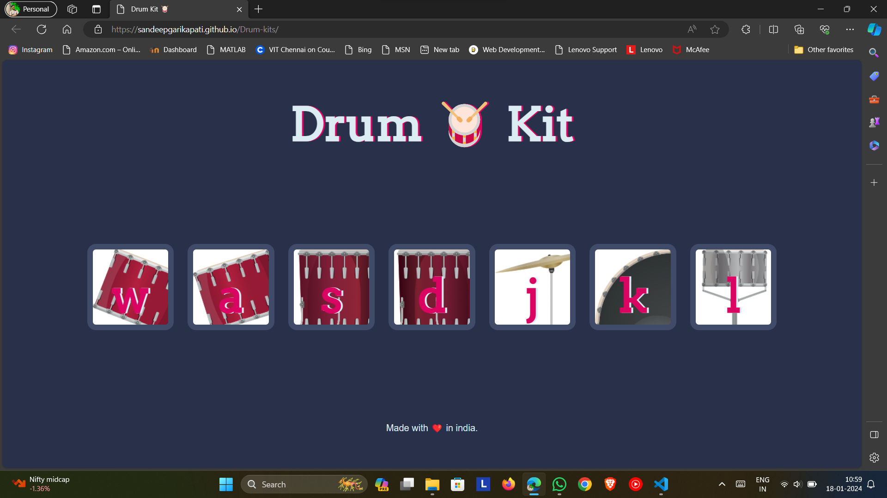

# Drum Kit 🥁

This is a simple Drum Kit web application where you can play drums by pressing corresponding keys on your keyboard.



## Table of Contents
- [Introduction](#introduction)
- [Usage](#usage)
- [Technologies](#technologies)
- [Setup](#setup)
- [Contributing](#contributing)
- [License](#license)

## Introduction

The Drum Kit is a fun project that allows users to simulate playing drums by pressing keys associated with different drum sounds.

## Usage

1. Open the [Drum Kit](#) web application in your browser.
2. Press the specified keys (w, a, s, d, j, k, l) to play different drum sounds.
3. Enjoy creating your beats!

## Technologies

- HTML
- CSS
- JavaScript

## Setup

1. Clone the repository:

   ```bash
   git clone https://github.com/your-username/drum-kit.git
   ```
